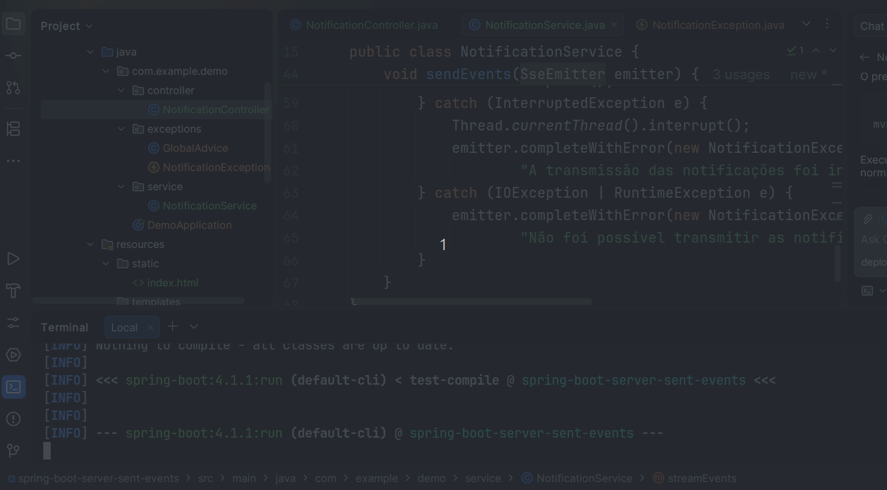

## Introduction

`spring boot demo` is a project for learning and practicing `spring boot`, including other technologies.

## Por que usar cada tecnologia?

### Por que usar Spring Boot Actuator?

O Actuator expõe informações e endpoints de operação da aplicação, como saúde,
métricas e configurações. Ele é útil para monitorar serviços em execução e
integrá-los a ferramentas de observabilidade.

[Projeto: spring-boot-actuator](./spring-boot-actuator) - monitoramento e gerenciamento com Spring Boot Actuator.

### Por que usar Apache Kafka?

Kafka é indicado para processar grandes volumes de eventos de forma distribuída,
desacoplando produtores e consumidores. Também permite que as mensagens sejam
processadas de forma assíncrona e escalável.

[Projeto: spring-boot-apache-kafka-producer-and-consumer](./spring-boot-apache-kafka-producer-and-consumer) - produção e consumo de mensagens com Apache Kafka.

### Por que usar Elasticsearch?

Elasticsearch é apropriado para buscas rápidas e flexíveis em grandes volumes de
dados. Seu modelo orientado a documentos facilita consultas textuais,
filtros e análise.

[Projeto: spring-boot-elasticsearch](./spring-boot-elasticsearch) - integração com Elasticsearch.

### Por que usar Flyway?

Flyway mantém a evolução do banco de dados versionada junto ao código-fonte.
Isso torna as alterações reproduzíveis, auditáveis e mais seguras em diferentes
ambientes.

[Projeto: spring-boot-flyway](./spring-boot-flyway) - versionamento de banco de dados com Flyway.

### Por que usar Spring Security com formulário de login?

Spring Security fornece autenticação, autorização e proteção contra ameaças
comuns. O login baseado em formulário é uma opção simples para aplicações web
que precisam controlar o acesso a páginas e recursos.

[Projeto: spring-boot-form-login](./spring-boot-form-login) - autenticação com formulário e Spring Security.

### Por que usar Google Translate?

Uma API de tradução permite adaptar conteúdo para diferentes idiomas sem
implementar um mecanismo linguístico próprio. Ela é útil em aplicações
internacionalizadas e fluxos que recebem texto de usuários.

[Projeto: spring-boot-google-translate](./spring-boot-google-translate) - integração com Google Translate.

### Por que usar gRPC?

gRPC usa contratos definidos por protocolo e comunicação eficiente para integrar
serviços. É especialmente útil em arquiteturas distribuídas que precisam de
baixa latência, tipagem forte e geração automática de clientes.

[Projetos gRPC:](./spring-boot-grpc) [cliente](./spring-boot-grpc/spring-boot-grpc-client) e [servidor](./spring-boot-grpc/spring-boot-grpc-server).

### Por que usar iText?

iText facilita a geração programática de documentos PDF com controle sobre
texto, imagens e layout. Isso é útil quando a aplicação precisa produzir
relatórios ou documentos sob demanda.

[Projeto: spring-boot-itext-generate-pdf](./spring-boot-itext-generate-pdf) - geração de arquivos PDF com iText.

### Por que usar Spring JDBC?

Spring JDBC reduz o código repetitivo de acesso relacional sem esconder o SQL.
É uma boa escolha quando se deseja controle direto sobre consultas e operações
de persistência.

[Projeto: spring-boot-jdbc](./spring-boot-jdbc) - persistência com Spring JDBC.

### Por que usar JMH?

JMH foi projetado para medir desempenho de código Java com menor interferência
do ambiente de execução. Ele ajuda a comparar implementações e identificar
otimizações baseadas em medições.

[Projeto: spring-boot-jmh-warmup](./spring-boot-jmh-warmup) - benchmarks e warmup com Java Microbenchmark Harness (JMH).

### Por que usar Spring Data JPA?

JPA permite trabalhar com entidades Java e seus relacionamentos, reduzindo o
código necessário para persistência. É útil para domínios relacionais que
precisam de mapeamento objeto-relacional e operações de consulta.

[Projeto: spring-boot-jpa](./spring-boot-jpa) - persistência com Spring Data JPA.

### Por que usar MongoDB?

MongoDB armazena documentos flexíveis e facilita a evolução de estruturas que
mudam com frequência. É adequado para dados orientados a documentos e cenários
que precisam de escalabilidade horizontal.

[Projeto: spring-boot-mongodb](./spring-boot-mongodb) - integração com MongoDB.

### Por que usar MyBatis?

MyBatis combina o mapeamento de resultados para objetos com o controle explícito
das consultas SQL. Ele é útil quando consultas complexas ou otimizações
específicas do banco são importantes.

[Projeto: spring-boot-mybatis](./spring-boot-mybatis) - persistência com MyBatis.

### Por que usar OpenFeign?

OpenFeign simplifica a criação de clientes HTTP declarativos a partir de
interfaces. Isso reduz código de integração e deixa os contratos entre serviços
mais claros.

[Projeto: spring-boot-openfeign](./spring-boot-openfeign) - clientes HTTP declarativos com OpenFeign.

### Por que usar R2DBC?

R2DBC permite acesso não bloqueante a bancos relacionais. Ele é indicado para
aplicações reativas que precisam manter o fluxo assíncrono de ponta a ponta.

[Projeto: spring-boot-r2dbc](./spring-boot-r2dbc) - acesso reativo a banco de dados com R2DBC e H2.

### Por que usar RabbitMQ?

RabbitMQ fornece filas, roteamento e confirmação de mensagens entre serviços.
Ele é útil para desacoplar tarefas, absorver picos de processamento e executar
operações de forma assíncrona.

[Projeto: spring-boot-rabbitmq](./spring-boot-rabbitmq) - mensageria com RabbitMQ.

### Por que usar Spring WebFlux?

WebFlux oferece um modelo reativo e não bloqueante para aplicações com alta
concorrência ou operações predominantemente assíncronas. Ele ajuda a utilizar
recursos de forma eficiente quando há muitas conexões simultâneas.

[Projeto: spring-boot-reactive](./spring-boot-reactive) - aplicação reativa com Spring WebFlux e MongoDB.

### Por que usar Redis?

Redis oferece operações rápidas em memória para cache, sessões, contadores e
estruturas de dados. Ele é útil quando a aplicação precisa reduzir latência ou
aliviar a carga do banco principal.

[Projeto: spring-boot-redis](./spring-boot-redis) - integração com Redis.

### Por que usar Spring Retry?

Spring Retry permite repetir operações temporariamente falhas com políticas
configuráveis. É útil para chamadas a serviços externos e recursos sujeitos a
indisponibilidade transitória.

[Projeto: spring-boot-retry](./spring-boot-retry) - tolerância a falhas e novas tentativas com Spring Retry.

### Por que usar tarefas agendadas?

O agendamento do Spring permite executar rotinas em horários ou intervalos
definidos. Ele é adequado para manutenção, sincronizações, notificações e
processamentos recorrentes.

[Projeto: spring-boot-schedule](./spring-boot-schedule) - execução de tarefas agendadas.

### Por que usar Twilio para SMS?

Twilio fornece uma API para envio de mensagens SMS sem que a aplicação precise
gerenciar a infraestrutura das operadoras. Isso facilita notificações,
alertas e fluxos de autenticação por código.

[Projeto: spring-boot-sms](./spring-boot-sms) - envio de SMS com Twilio.

### Por que usar Swagger/OpenAPI?

Swagger e OpenAPI padronizam a descrição dos endpoints, parâmetros e respostas de
uma API. A documentação gerada facilita testes, integração entre equipes e
manutenção dos contratos.

[Projeto: spring-boot-swagger-documentation](./spring-boot-swagger-documentation) - documentação de APIs com Swagger/OpenAPI.

### Por que usar Server-Sent Events (SSE)?

Este projeto demonstra uma implementação simples, prática e leve de Server-Sent
Events (SSE) utilizando Java, Spring Boot e HTML5 (`EventSource`).

O objetivo é ilustrar como um servidor (**Producer**) pode enviar atualizações
contínuas e em tempo real para o cliente (**Consumer**) via HTTP unidirecional.

Ao contrário de WebSockets, que são bidirecionais e utilizam o protocolo
`ws://`, o SSE funciona sobre o protocolo HTTP padrão em uma conexão persistente
(`text/event-stream`).

- **Servidor (Producer):** mantém a conexão aberta e envia eventos em formato de
  texto conforme eles acontecem.
- **Cliente (Consumer):** o navegador reconecta automaticamente se a conexão
  cair e reage aos eventos recebidos usando a API nativa `EventSource`.

### Demonstração do Server-Sent Events

[Projeto: spring-boot-server-sent-events](./spring-boot-server-sent-events) - comunicação em tempo real com Server-Sent Events (SSE).

## Environment

- **JDK 1.8 +**
- **Maven 3.5 +**
- **IntelliJ IDEA ULTIMATE 2018.2 +**

### License

[MIT](http://opensource.org/licenses/MIT)
