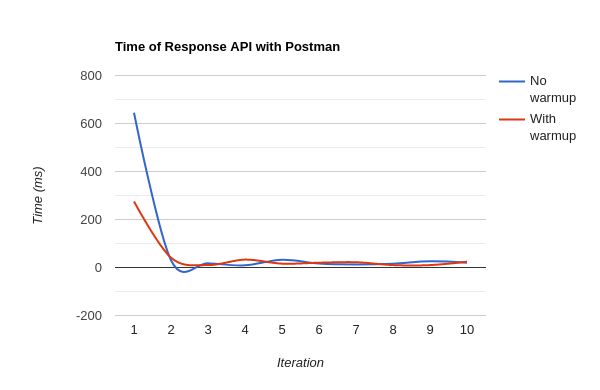

# spring-boot-actuator

> Spring Boot with Java Microbenchmark Harness (JMH) warmup.

## Time of Response API - Line Chart


## Time of Response API - Table
| Iterations         | No warmup (ms)| With warmup (ms)|
|--------------------|---------------|-----------------|  
| 1                  | 645           | 275             |  
| 2                  | 30            | 41              |  
| 3                  | 18            | 10              |  
| 4                  | 9             | 33              |  
| 5                  | 32            | 16              |  
| 6                  | 17            | 20              |  
| 7                  | 13            | 22              |  
| 8                  | 16            | 10              |  
| 9                  | 26            | 10              |  
| 10                 | 20            | 24              |  


## TestBenchmark.java
```java
@Configuration
@State(Scope.Benchmark)
@Threads(1)
public class TestBenchmark {

    @Benchmark
    @BenchmarkMode(Mode.All)
    @Setup(Level.Iteration)
    @Fork(warmups = 1, value = 1)
    @Warmup(batchSize = -1, iterations = 10, time = 1, timeUnit = TimeUnit.MILLISECONDS)
    @Measurement(batchSize = -1, iterations = 10, time = 1, timeUnit = TimeUnit.MILLISECONDS)
    @OutputTimeUnit(TimeUnit.MILLISECONDS)
    public void run(Blackhole bh) throws Exception {
        bh.consume(new MessageService().getMessages());
    }

    @Bean
    public void benchmark() throws Exception {
        String[] argv = {};
        org.openjdk.jmh.Main.main(argv);
    }

}
```
## MessageController.java
```java
@RestController
@RequestMapping("message")
public class MessageController {

    @Autowired
    private MessageService messageService;

    @GetMapping
    public ResponseEntity getMessages(){
        return ResponseEntity.ok(messageService.getMessages());
    }
}
```

## MessageService
```java
@Service
public class MessageService {

    private final Integer MIN_MSG_ITERATIONS = 0;
    private final Integer MAX_MSG_ITERATIONS = 10;

    public List<Message> getMessages() {
        List<Message> messages = new ArrayList<>();
        IntStream.range(MIN_MSG_ITERATIONS, MAX_MSG_ITERATIONS).forEach( i -> {
            messages.add(new Message());
        });
        return messages;
    }

}
```

## Message
```java
@Getter
@Setter
@ToString
public class Message {
    private Integer id;
    private String text;
    private LocalDateTime received;

    public Message() {
        this.id = new Random().nextInt();
        this.text = UUID.randomUUID().toString();
        this.received = LocalDateTime.now();
    }
}
```

## DemoApplication
```java
@SpringBootApplication
public class DemoApplication {
    public static void main(String[] args) {
        SpringApplication.run(DemoApplication.class, args);
    }
}
```
## Run Application
`mvn spring-boot:run`

## Postman
><code>[postman/postman_collection.json](postman/postman_collection.json)</code>
